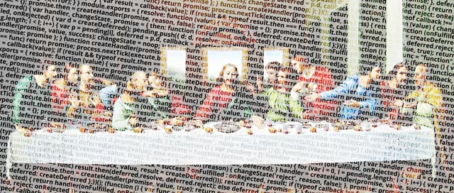

Computer Science is a theory, yet Computer Programming — an art. The elegantly written code, like any literature, is inspirational, and adopts aesthetics to achieve high maintainability. Paul Graham — one of my favourite programmers and computer scientists, who studied painting at the beginning of his career path — is one such well-known proponent of this belief. Paul outlined the many parallels between painters and ~~hackers~~ programmers in one of his essays, <a href="http://www.paulgraham.com/hp.html" target="_blank">Hackers and Painters</a>: both build something from the ground up, both improve their masterpiece through gradual refinements, and both produce works intended for a human audience.

> What hackers and painters have in common is that they're both makers. Along with composers, architects, and writers, what hackers and painters are trying to do is make good things.

Like art, computer programming is a medium of self-expression that is available to virtually all. There is no need for programmers to have a background in math, nor are college courses — all that is needed is a machine and an idea. With computer programming, the possibilities are virtually limitless. The only constraint is your imagination.

Programming is an art, so we are artists. We are not, however, the kind of artists who create purely for beauty. We're a functional artist. We have a functional task as well as a duty to write beautiful code, because it is effective and therefore lasts.

###### References

- [Paul Graham's Hackers and Painters](http://www.paulgraham.com/hp.html)
- [Ruben Verborgh's image](https://ruben.verborgh.org/images/blog/programming-art.jpg)
- [Inspired by Ruben Verborgh](https://ruben.verborgh.org/blog/)
